


 

  


 


 


 


<i>Technologies I work with</i>

  


 



 

 


<i>AI • Cybersecurity • Machine Learning • Software Engineering</i>

  

<table align="center" width="96%">
<tr>
<td width="33%" align="center"><a href="https://github.com/cleasaji/PhishGuard-AI"></a></td>
<td width="33%" align="center"><a href="https://github.com/cleasaji/LogSentinel"></a></td>
<td width="33%" align="center"><a href="https://github.com/cleasaji/NetGuard-IDS"></a></td>
</tr>
<tr>
<td width="33%" align="center"><a href="https://github.com/cleasaji/CodeSentry"></a></td>
<td width="33%" align="center"><a href="https://github.com/cleasaji/DeepVoice-Shield"></a></td>
<td width="33%" align="center"><a href="https://github.com/cleasaji/SecretScan"></a></td>
</tr>
</table>

 

 


<i>Systems and security engineering, built from scratch and tested</i>

  


 

<table align="center" width="96%">
<tr>
<td width="33%" align="center"><a href="https://github.com/cleasaji/FuzzForge"></a></td>
<td width="33%" align="center"><a href="https://github.com/cleasaji/ChainAudit"></a></td>
<td width="33%" align="center"><a href="https://github.com/cleasaji/StreamGuard"></a></td>
</tr>
<tr>
<td width="33%" align="center"><a href="https://github.com/cleasaji/CompilerSentry"></a></td>
<td width="33%" align="center"><a href="https://github.com/cleasaji/GatewayMesh"></a></td>
<td width="33%" align="center"><a href="https://github.com/cleasaji/ModelGuard"></a></td>
</tr>
<tr>
<td width="33%" align="center"><a href="https://github.com/cleasaji/MobileVault"></a></td>
<td width="33%" align="center"><a href="https://github.com/cleasaji/kaushal-vaani"></a></td>
<td width="33%" align="center"><a href="https://github.com/cleasaji/team-sirius"></a></td>
</tr>
</table>

 



  

 


 


 



 


  

 

  

 



 




 

 



 



 


  


 


 

  


